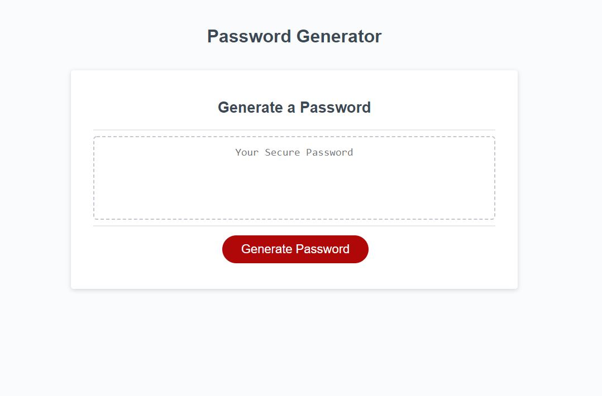

Password Generator:
This is a small website that can generate a password based on certain preferences. Preferences include whether or not you want to include Numbers and or punctuation.
 
Usage:
You will simply click the Generate Password Button and you will be represented with some prompts that will ask you how many characters you want in your password, whether you want numbers included, and whether you want special characters included. After this it will simply generate a password in the textbox in the center.
 
Motivation:
My motivation in creating this website was to create a simple password generator that people can use.
 
Problem Solving:
This solves the problem of looking up one's own password generator that might be able to track the generation and potentially trace it back to you.
 
What I learned:
I learned that it is very difficult to create a randomly generated password but I hope to learn how to simplify it in the near future.
 
Webpage:

